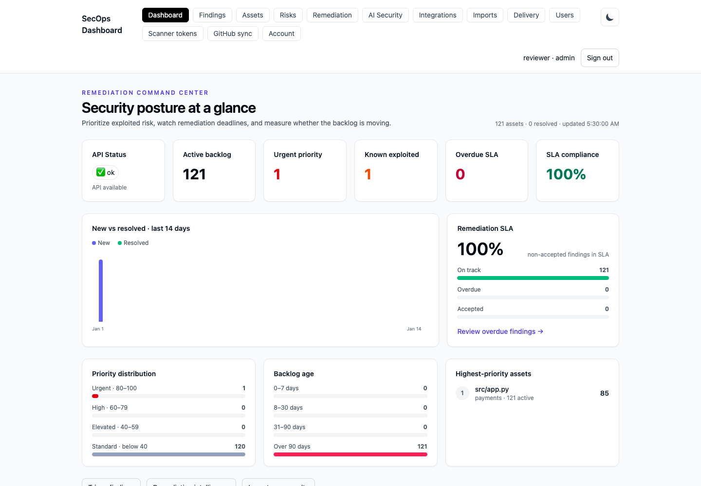

# SecOps Dashboard

A self-hosted dashboard for importing, normalizing, deduplicating, and triaging
security findings. FastAPI and PostgreSQL provide the API and persistence;
Next.js provides the dashboard. A separate worker delivers durable Slack and
Jira notification jobs.

The source is public on GitHub under the [MIT License](LICENSE). Run your own
instance to use the dashboard; this repository does not provide a shared hosted
service. Local credentials, scan data, and database files stay in your checkout
and are excluded from Git.

See the [0.2.0 release notes](CHANGELOG.md) for team workflows, runtime compatibility,
and upgrade notes.



## Try it locally

Install Python 3.12+ and Node.js 24+ (24 LTS recommended), then use macOS, Linux,
or Windows with WSL2. Docker and PostgreSQL are not needed for this quickstart.
The first start downloads dependencies and builds the dashboard, so allow a few
minutes and an internet connection to the package registries.

Use a current browser. The Tailwind CSS 4 interface requires at least Chrome 111,
Safari 16.4, or Firefox 128, following
[Tailwind's browser requirements](https://tailwindcss.com/docs/compatibility).

```bash
git clone https://github.com/djvirus9/secops-dashboard.git
cd secops-dashboard
python3 scripts/local.py start
python3 scripts/local.py credentials
python3 scripts/local.py seed  # optional synthetic findings in project "demo"
```

Open <http://127.0.0.1:5050/login> and sign in with the initial administrator
credentials shown by `credentials` in your terminal. Change your password on the
Profile page; the initial password shown by the helper then becomes obsolete.
That command avoids printing credentials when
its output is redirected. The API listens on <http://127.0.0.1:8000>; both services
bind only to your computer. If a port is occupied, use
`python3 scripts/local.py start --port 5051 --api-port 8001`.

The helper creates `.venv`, installs dependencies, builds the production frontend,
and applies database migrations. Later starts reuse unchanged dependencies and
builds. Local settings, logs, and process state live in the Git-ignored `.local/`
directory; `.local/secops.db` stores your findings and `.local/env.json` stores
generated credentials with owner-only permissions. The helper disables external
Slack/Jira integrations and uses its own settings instead of a production `.env`.

```bash
python3 scripts/local.py status
python3 scripts/local.py stop
```

Stopping preserves accounts, current passwords, sessions, and data. Starting
again restores the same instance without resetting a changed password. Seeding
uses the private backend API key and still works after password changes; it skips
import when the demo project already has findings. To recover an account, run
`python3 scripts/local.py reset-password --username admin` in your terminal and
enter the new password twice. Recovery revokes that user's existing sessions.
Keep `.local/`, `.env`, and database files private; review attachments and diffs
before posting them to GitHub. For code changes and tests, see
[CONTRIBUTING.md](CONTRIBUTING.md). For PostgreSQL or a server installation,
continue with Docker Compose below.

## Supported deployment

This release is intended for **one trusted security team** on a single deployment.
Version 0.2 provides individual local accounts, administrator/analyst/viewer roles,
and server-enforced project grants. Administrators can access every project and
manage accounts; analysts can modify allowed projects; viewers can read them.
An explicit empty grant list allows no projects. SSO, MFA, GitHub synchronization,
and isolation between separate organizations are future work. Use a private
network or access gateway and HTTPS for every non-local deployment.

The backend authenticates browser sessions with an HttpOnly, SameSite=Strict
cookie. The frontend forwards that cookie and receives no administrative API key
or bootstrap password. `API_KEY` remains an unrestricted administrative automation
credential. Scanners use a separate `INGEST_API_KEY` accepted only by
`POST /ingest/signal` and `POST /import/scan`; that shared key can ingest into any
project. Keep both keys out of browsers and untrusted scanner jobs.

Mutating browser requests must match an exact canonical origin in
`DASHBOARD_ORIGINS`; request `Host` and forwarding headers do not establish trust.
The Compose/manual default `http://localhost:5000` is for local use; the quickstart
helper configures its own loopback origin on port 5050. Public deployments must
set their own HTTPS origin explicitly.

## Team workflows

Administrators create accounts and project grants on the Users page. Each account
can change its own password and keep private saved finding views (up to 100).
Saved filters are always applied inside the current user's project grants.

Administrators and analysts can select up to 200 explicit findings for a bulk
triage action. The whole request is rejected if any selected finding is missing,
unauthorized, or invalid; it does not silently update a subset. CSV export includes
only allowed findings and is capped at 10,000 rows and 16 MiB. Narrow the filters
if the limit is exceeded. Formula-like or control-prefixed cells are visibly
prefixed with `[text]` so spreadsheets treat scanner text as data. Exported reports
still contain sensitive security findings; handle them accordingly.

See the [threat model](docs/threat-model.md) for trust boundaries and residual risks.

## Run with Docker Compose

Requirements: Docker with Compose v2. For a public deployment, first follow the
[production runbook](docs/operations.md), including HTTPS and backup setup.
The images use Python 3.14 and default to Node.js 24 LTS. Set
`FRONTEND_NODE_MAJOR=26` in `.env` to build the frontend image with Node 26.
Node 26 is Current as of the 0.1.0 release; see the
[Node.js release announcement](https://nodejs.org/en/blog/release/v26.0.0).

```bash
umask 077
cp .env.example .env
openssl rand -hex 32  # generate a different value for each required secret
```

Fill in `POSTGRES_PASSWORD`, `API_KEY`, `INGEST_API_KEY`, and `DASHBOARD_PASSWORD`
in `.env`. Use independent generated values. API keys require at least 32
characters; PostgreSQL and initial bootstrap passwords require at least 24.
Passwords created or changed through account management require 15–1,024
characters; generated bootstrap passwords are recommended. Missing,
short, duplicate API keys, and placeholder bootstrap values fail validation. The example
leaves secrets empty intentionally.

For a local Compose demo at `http://localhost:5000`, explicitly set
`SESSION_COOKIE_SECURE=false` in `.env`. Keep its default `true` for HTTPS
deployments. The insecure setting is accepted only when every configured origin
is strict loopback HTTP. Session defaults are 12 hours absolute and 30 minutes
idle; an idle timeout cannot exceed the absolute lifetime.

```bash
docker compose --env-file .env -f infra/docker-compose.yml config --quiet
docker compose --env-file .env -f infra/docker-compose.yml up --build -d
docker compose --env-file .env -f infra/docker-compose.yml ps
```

Open <http://localhost:5000/login> and enter the initial administrator credentials.
All published ports bind to loopback by default. The host-side TLS reverse proxy
is the public entrypoint. Backend startup validates configuration and applies
migrations; the frontend and worker wait for database readiness.

`DASHBOARD_USERNAME` and `DASHBOARD_PASSWORD` bootstrap the first administrator
only when the database contains no accounts. They never reset existing passwords
on upgrade or restart. API-only installations can omit both values; supplying
only one is rejected. See the runbook for account recovery and upgrades from 0.1.

**Upgrading an existing installation:** take and verify a backup first. Older
databases created with `create_all` need the explicit legacy adoption procedure
in the [runbook](docs/operations.md#upgrade-and-legacy-database-adoption).
Startup never stamps an unknown existing schema automatically.

## Parser support and evidence

The parser registry retains historical adapters, but production imports enable
only formats covered by representative versioned fixtures. Unsupported adapters
are visible with their support status and remain disabled by default. See the
[parser support matrix](docs/parser-support.md) for enabled formats, versions,
and limitations. `ALLOW_UNVERIFIED_PARSERS=true` is an explicit compatibility
opt-in; validate imported records before relying on those adapters.

Raw scanner objects are not stored by default because they may contain source
code or live credentials. Known secret-scanner evidence is redacted before
persistence and notifications. Enabling `STORE_RAW_SCAN_DATA=true` requires an
appropriate encrypted storage, access, backup, and retention policy.

Finding identity includes available project and component evidence. Historical
unscoped records keep their existing identity. Reimporting with a newly assigned
project/component or a corrected scanner location (for example, CredScan file
paths) can create a distinct record; the application does not guess how to merge
or close historical findings. Import history records outcomes separately from
retained raw scanner content.

`IMPORT_TIMEOUT_SECONDS` defaults to 900 seconds. The importer checks this deadline
before committing findings, and the history view identifies overdue processing
runs as interrupted even if the worker is unavailable. The worker persists that
interrupted state when it next polls. Split slow reports and submit them again;
an import deadline does not forcibly terminate a running parser process.

## Manual development setup

Use Python 3.12+ and Node.js 24 LTS. SQLite is supported for local development;
PostgreSQL is the production and CI database. Use this setup for live code
reloading; stop the quickstart helper before reusing its API port or frontend
build directory. See [CONTRIBUTING.md](CONTRIBUTING.md) for the contribution workflow.

The tracked `.replit` file is a legacy template with unmaintained runtime settings.
That development/deployment route is unsupported for this release; use the local
commands below or Docker Compose instead.

```bash
export DATABASE_URL=sqlite:///./secops.db
export API_KEY="$(openssl rand -hex 32)"
export INGEST_API_KEY="$(openssl rand -hex 32)"
export DASHBOARD_USERNAME=admin
export DASHBOARD_PASSWORD="$(openssl rand -hex 32)"
export DASHBOARD_ORIGINS=http://localhost:5000
export SESSION_COOKIE_SECURE=false
export BACKEND_URL=http://localhost:8000
export ALLOWED_HOSTS=localhost,127.0.0.1,testserver

python3.12 -m venv .venv
. .venv/bin/activate
pip install -r backend/requirements-dev.txt
(cd backend && python -m app.deployment && alembic upgrade head && uvicorn app.main:app --reload)
```

In another shell export only `BACKEND_URL` and `DASHBOARD_ORIGINS`, then run
`cd frontend && npm ci && npm run dev`. To exercise notifications, start
`python -m app.notifications.worker` from `backend` with the same database and
integration settings. The dashboard runs on port 5000 and the API on port 8000.
Local development can explicitly opt out of backend authentication with
`ALLOW_INSECURE_NO_AUTH=true`; Compose always disables this escape hatch.

## Tests and checks

```bash
cd backend
pytest -q
python -m compileall -q app
alembic check

cd ../frontend
npm ci
npm run build
npx playwright install chromium
npm run test:e2e
npm run test:integration  # Python backend + isolated migrated SQLite database
npm audit --audit-level=high
```

Tests apply real migrations and clear test rows between cases. The migration
suite validates fresh databases and data-preserving upgrades from both legacy
schema variants. Set `TEST_DATABASE_URL` only to a **disposable PostgreSQL test
database** to exercise its PostgreSQL cases; tests delete application rows and
create/drop temporary test schemas. CI runs these checks on PostgreSQL, along
with dependency audits, CodeQL, production browser tests, and Docker builds.

## API and operations

- `GET /health` and `GET /ready`: public liveness and database/schema readiness.
- `POST /ingest/signal`, `POST /import/scan`: ingestion-only credential access.
- `POST /auth/login`, `GET /auth/me`, `POST /auth/logout`, `POST /auth/password`:
  browser account sessions and password changes.
- Findings, assets, risks, imports, comments, and CSV export: role and project access.
- Saved views: private to their owning user session.
- Account management, integration status/tests, notification review, and authenticated
  OpenAPI documentation: administrative access.
- `MAX_IMPORT_REQUEST_BYTES`, `MAX_SCAN_BYTES`, and `MAX_FINDINGS_PER_IMPORT`
  independently cap HTTP payloads, decoded content, and database import work.
  `MAX_REQUEST_BYTES` also caps request bodies on every non-import route.

See [.env.example](.env.example) for configuration and the
[operations runbook](docs/operations.md) for TLS, backup/restore, upgrades,
credential rotation, notification recovery, and release verification.

## Contributing, security, and license

Bug reports and pull requests are welcome; see [CONTRIBUTING.md](CONTRIBUTING.md).
Report vulnerabilities privately through the process in [SECURITY.md](SECURITY.md).
This project is available under the [MIT License](LICENSE); dependencies retain
their own licenses.
