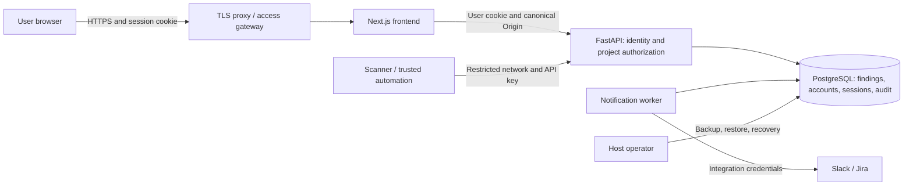

# Threat model: version 0.2

This model describes the repository's self-hosted architecture and its automated
checks. It does not attest to a particular running server, cloud account, or
operator's network configuration. The supported deployment serves one trusted
team with local accounts and project grants. SSO, MFA, GitHub synchronization,
organization tenancy, and high availability are outside this release.

## Assets, actors, and boundaries

Protected assets include findings and scanner evidence, project membership,
password hashes and sessions, saved views, audit history, API/integration secrets,
database backups, and service availability. Treat imported scanner text as
untrusted even when the scanner has a valid ingestion key.

| Actor | Authority |
| --- | --- |
| Unauthenticated visitor or hostile website | Can reach public health/login endpoints and try to induce browser requests |
| Viewer | Reads granted projects, exports their findings, and manages private saved views |
| Analyst | Viewer capabilities plus writes/imports/triage within granted projects |
| Administrator | All projects, accounts, integrations, and notification administration |
| Administrative automation | Full API authority across projects using `API_KEY`; fixed `api-admin` audit identity |
| Scanner job | Ingestion into any project with `INGEST_API_KEY`; no read or account administration |
| Host/database operator | Controls deployments, backups, and interactive account recovery; outside application ACL isolation |

The browser/frontend boundary carries user sessions, never a frontend-injected
administrative key. The backend checks roles and project grants independently
of submitted filters and proxy headers. The database and worker are trusted
components; PostgreSQL, backend, and frontend ports bind to loopback in the
documented host-proxy setup. The local helper substitutes isolated SQLite and
strict loopback HTTP, disables integrations, and keeps its secrets outside Git.

## Prioritized abuse cases

Likelihood and impact below assume an attacker can reach the deployment but
does not already control its host. Detection is limited by the operator's review
of application audit history and infrastructure logs.

| Priority and risk | Likelihood / impact / detection | Mitigation and verification |
| --- | --- | --- |
| 1. Access another project's findings through IDs, aggregates, saved filters, bulk actions, or CSV | Medium / high / unauthorized reads can be hard to detect | Backend scope checks on reads/writes, private saved-view ownership, and all-or-none bulk authorization; test every role with allowed/denied projects, mixed IDs, and changed grants |
| 1. Take over an account or retain a stolen session after access changes | Medium / high / successful misuse may resemble normal activity | Argon2 password hashes, opaque database-backed revocable sessions, absolute/idle expiry, login throttling, revocation after password/account/grant changes; test expiry, logout, recovery, bootstrap-once, and concurrent last-admin protection |
| 1. Trick a signed-in browser into a write or smuggle an administrative credential through the frontend | Medium / high / failed requests visible, attempts need monitoring | Exact configured origins for login and cookie writes, SameSite=Strict/HttpOnly cookies, Secure default, stripped proxy identity/API-key headers, no frontend bootstrap secrets; browser and Compose tests cover anonymous access, hostile origins, login/logout and header boundaries |
| 1. Steal automation/integration secrets or sensitive evidence from logs, exports, backups, or public Git | Medium / high / often difficult to detect | Private local files, no secrets in CLI arguments/captured output, normalized secret redaction, raw payload storage disabled, no raw/description CSV fields; test proxy bypass, frontend env separation and secret-evidence handling; operator owns storage encryption and retention |
| 2. Exhaust resources with login attempts, giant reports, repeated exports, or many saved views | Medium / medium–high / request failures and resource use are observable | Global/account login throttles, request/parser/import limits, import deadline, 100 saved views per user, 200 bulk IDs, 10,000-row/16-MiB CSV caps; test boundaries and rejected transactions; operator owns upstream rate limits and capacity monitoring |
| 2. Execute spreadsheet formulas or browser markup embedded in scanner evidence | Medium / high / a user's workstation may be affected outside server logs | React text rendering, URL checks, fully quoted CSV and visible `[text]` prefixes for formula-like/control-leading values; test hostile cells, special quoting and browser rendering |
| 2. Lose account state or reinstate revoked access during deployment/recovery | Low–medium / high / restore errors are detectable, stale access may not be | Data-preserving migrations, bootstrap only when no users exist, verified backups, interactive recovery with session revocation; local smoke changes a password and verifies sessions/data/re-login after restart |
| 2. Duplicate or misroute external notifications after failure | Medium / medium / delivery state is visible | Durable jobs, bounded retries and explicit handling of uncertain outcomes; use synthetic integrations in tests, review uncertain Jira creation before retrying |

## Residual risks and operator decisions

- Administrators, host/database operators, and `API_KEY` remain globally trusted.
  Project grants do not isolate separate organizations from those actors. The
  shared ingestion key can write to any project; protect scanner jobs and rotate
  compromised keys. There is no per-scanner key inventory or project-scoped API key.
- A stolen live user session can act until it expires or is revoked. HttpOnly
  limits token reads by JavaScript; it does not make same-origin script compromise
  harmless. MFA and federated identity are not present.
- Login throttles can also be used to delay legitimate logins. Network/access
  gateway controls and monitoring remain necessary. Import deadlines do not
  terminate a running parser process, and row/byte limits are not full resource
  isolation against authorized high-volume traffic.
- Normalized findings, comments and CSVs can still contain confidential data.
  Redaction is targeted, not a guarantee that every secret or sensitive string
  is removed. Export prefixes are intentionally visible and must not be removed
  automatically before opening untrusted cells in a spreadsheet.
- Backups include password hashes, grants, sessions and audit records. Restoring
  an older database can restore access valid at backup time. Revoke affected
  sessions when recovering from compromise. Audit tables are not tamper-proof
  against a database/host administrator.
- Slack delivery can repeat after interruption; uncertain Jira retries can
  create duplicates. No external service, retention schedule, TLS certificate,
  backup destination, recovery objective, or alerting system is provisioned by
  this source repository. Operators must choose and verify those controls.

No unresolved owner input is needed for the local demo. Before a network
deployment, the operator must choose the trusted team, project grants, canonical
HTTPS origin/access gateway, retention and backup/recovery objectives, and
integration destinations. Follow the [operations runbook](operations.md).
